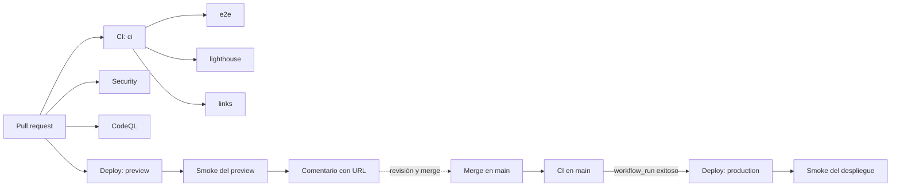

# fextracode

Landing bilingüe (ES/EN) de Fernando Morales en [https://fextracode.com](https://fextracode.com).

[](https://github.com/FerS00/Landing/actions/workflows/ci.yml)
[](https://github.com/FerS00/Landing/actions/workflows/codeql.yml)
[](https://github.com/FerS00/Landing/actions/workflows/security.yml)
[](https://github.com/FerS00/Landing/actions/workflows/deploy.yml)

## Stack

Astro 7 y TypeScript, sin framework de UI. El sitio se publica en Cloudflare Pages e incluye una Pages Function para el formulario de contacto. Las fuentes se sirven desde el propio sitio.

## Requisitos y comandos

Node.js 22.12 o posterior. `.nvmrc` especifica la versión usada en CI.

```sh
npm ci
npm run dev
npm run build
npm run preview
npm run lint
npm run format:check
npm run check
npm test
npm run test:e2e
npm run lhci
npm run og
npm run smoke -- https://fextracode.com
```

`npm run og` requiere un build previo. `npm run smoke` acepta una URL como argumento o mediante `SMOKE_URL`.

## Pipeline CI/CD

En un pull request, `ci` ejecuta primero las comprobaciones base; después se ejecutan sus tres jobs dependientes. `Security` y `CodeQL` corren en paralelo. Para pull requests desde el mismo repositorio, `Deploy` publica un preview, lo comprueba con smoke y comenta la URL. Al completar con éxito `CI` por un push a `main`, `Deploy` construye y publica producción y ejecuta smoke.



| Workflow / job              | Valida                                                                                                                        | Falla cuando                                                                        |
| --------------------------- | ----------------------------------------------------------------------------------------------------------------------------- | ----------------------------------------------------------------------------------- |
| CI / `ci`                   | ESLint, formato, `astro check`, pruebas unitarias y build                                                                     | Falla cualquiera de esos comandos.                                                  |
| CI / `e2e`                  | Pruebas Playwright, incluidas comprobaciones axe                                                                              | Falla la instalación de Chromium o `npm run test:e2e`.                              |
| CI / `lighthouse`           | Umbrales definidos en `lighthouserc.json` sobre el sitio generado                                                             | Falla el build o Lighthouse CI no alcanza sus umbrales.                             |
| CI / `links`                | Enlaces y fragmentos internos del HTML generado, en modo offline                                                              | Lychee encuentra un enlace o fragmento inválido.                                    |
| Security / `gitleaks`       | Secretos en el historial completo                                                                                             | Gitleaks detecta un secreto.                                                        |
| Security / `npm-audit`      | Vulnerabilidades de producción desde nivel alto y del árbol completo desde nivel crítico                                      | `npm audit` encuentra una vulnerabilidad que alcanza el nivel configurado.          |
| Security / `osv-pr`, `osv`  | Vulnerabilidades de dependencias con OSV-Scanner                                                                              | OSV-Scanner reporta un hallazgo que hace fallar el workflow reutilizable.           |
| Security / `external-links` | Enlaces externos en ejecución semanal o manual                                                                                | No bloquea: el paso está configurado con `fail: false`.                             |
| CodeQL / `analyze`          | Análisis `security-extended` de JavaScript y TypeScript                                                                       | Falla la inicialización o el análisis de CodeQL.                                    |
| Deploy / `preview`          | Build, despliegue Cloudflare Pages y smoke del preview; comenta la URL                                                        | Build, despliegue o smoke falla; solo aplica a PR del mismo repositorio.            |
| Deploy / `production`       | Ref de rollback si corresponde, build, despliegue y smoke del despliegue; smoke del dominio si `PRODUCTION_URL` está definida | Ref inválida, build, despliegue o cualquiera de los smoke tests configurados falla. |

## Estructura

```text
.
├── .github/workflows/  # CI, CodeQL, seguridad y despliegue
├── design-system/      # especificación y prototipo
├── docs/               # plan y runbook
├── functions/api/      # Pages Function del formulario
├── public/             # recursos estáticos, OG y cabeceras
├── scripts/            # generación OG y smoke
├── src/                # páginas, componentes, contenido, estilos y lógica
└── tests/              # pruebas unitarias y e2e
```

GA4 y Clarity solo se cargan tras el consentimiento; sin IDs configurados no se carga analítica.

## Documentación

- [Plan del proyecto](docs/PLAN_PROYECTO.md)
- [Runbook de Cloudflare Pages](docs/RUNBOOK.md)
- [Dirección de diseño](design-system/fers00-landing/DESIGN.md)
