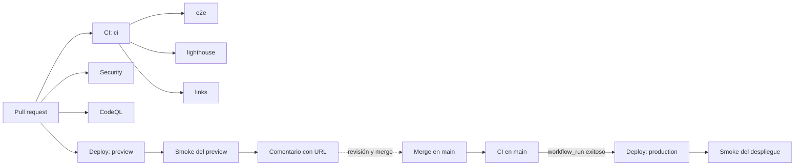

# PLAN_PROYECTO — Landing personal FerS00

> Plan canónico. Repositorio destino: `github.com/FerS00/Landing` (**público** desde 2026-10-07, rama `main` protegida).
> Dominio: **fextracode.com** (DNS ya en Cloudflare: `*.ns.cloudflare.com`).
> Fecha: 2026-10-08 (rev. 8). Estado: **cerrado por el momento; v1.0.0 entregada y corrección visual publicada en main `2f19d01` (PR #4). Evidencias en `docs/CIERRE_PROYECTO.md`**.

## 1. Objetivo

Publicar una landing bilingüe (español / inglés) que presente a Fernando Morales como desarrollador de software (backend, web, Windows nativo, IA aplicada) y que lleve a reclutadores y clientes a contactar. Es también el **primer proyecto CI/CD** del autor: cada cambio entra por pull request, pasa puertas de calidad automáticas, genera una vista previa desplegada y llega a producción solo al fusionar en `main`.

### Criterios de éxito

| Criterio | Medida |
|---|---|
| Bilingüe | `/` (es) y `/en/` con contenido completo, `hreflang` y selector de idioma; test que falla si falta una clave en un idioma |
| Rendimiento y calidad | Lighthouse ≥ 95 en Performance, Accessibility, Best Practices y SEO (móvil), comprobado en CI |
| Accesibilidad | 0 violaciones axe serias/críticas en ambas rutas |
| CI/CD | PR → checks + preview en Cloudflare Pages; merge a `main` → producción automática; rollback documentado y probado |
| Contenido | Todo dato coincide con el perfil y los repositorios públicos; nada inventado. Tono descriptivo: sin afirmaciones sobre la calidad del trabajo |
| Estabilidad | CLS < 0.01; la altura de la página no cambia por animaciones; ningún texto se sale de su contenedor en ES y EN a 375, 768 y 1280 px |
| Analítica | GA4 solo tras consentimiento explícito; ninguna petición a Google antes de aceptar (verificado en CI) |

### Fuera de alcance (v1)

Blog, CMS, más idiomas, panel de administración, pruebas A/B.

## 2. Decisiones tomadas

| ID | Decisión | Motivo |
|---|---|---|
| D-01 | **Astro + TypeScript**, sitio estático | i18n por rutas nativo, cero JS por defecto, build rápido en CI |
| D-02 | **Cloudflare Pages** como hosting, desplegado **desde GitHub Actions** con `wrangler pages deploy` | El pipeline lo controla el repo, no la integración automática de Cloudflare (así el CI/CD es "propio") |
| D-03 | Dominio **fextracode.com** (apex canónico; `www` redirige al apex) | La zona ya está en Cloudflare; el dominio personalizado de Pages se añade en Fase 6 |
| D-09 | Repositorio **público** | Permite proteger `main` con checks obligatorios, Environments con revisores y CodeQL gratis; el pipeline sirve de portfolio |
| D-10 | Plugin oficial de Cloudflare (skills + MCP) en Claude Code | Instalado el 2026-10-07 (`cloudflare@cloudflare` 1.0.1, ámbito usuario); requiere `/reload-plugins` y OAuth en el primer uso |
| D-04 | Dirección visual "señal viva" (v2): campo de partículas, titular cinético, terminal, demo de frontera de confianza | Ver `design-system/fers00-landing/DESIGN.md` y prototipo |
| D-05 | Español como idioma por defecto en `/`; inglés en `/en/` | Público principal hispanohablante; URLs estables para SEO |
| D-06 | Textos en archivos de traducción (`src/i18n/es.json`, `en.json`); proyectos como content collection con campos por idioma | Un solo origen de verdad por idioma; testeable |
| D-07 | Fuentes autoalojadas (`@fontsource`) | Sin dependencias de terceros en runtime; CSP más estricta |
| D-08 | Flujo de agentes: Claude especifica, Codex implementa, Antigravity audita (solo lectura) | Política global del usuario |
| D-11 | Diseño v3 negro y verde con terminal interactiva y filtro por tecnología | Preferencia del autor (2026-10-07) |
| D-12 | Tono descriptivo en todos los textos | El autor está empezando y no quiere afirmaciones que puedan volverse en su contra |
| D-13 | **Google Analytics 4** con Consent Mode v2 (todo denegado por defecto), aviso propio de consentimiento bilingüe, **Google Search Console** y Cloudflare Web Analytics (sin cookies) como base | El autor quiere GA; el consentimiento previo protege la privacidad y evita cargar scripts innecesarios |
| D-14 | Secretos `CLOUDFLARE_API_TOKEN` y `CLOUDFLARE_ACCOUNT_ID` creados como secretos de repositorio | Hecho por el usuario el 2026-10-08 (verificado con `gh secret list`, solo nombres) |
| D-15 | **Microsoft Clarity** bajo el mismo consentimiento que GA4 | Confirmado por el autor (resuelve A-09) |
| D-16 | FAQ y política de privacidad y cookies como ventanas modales, y además como páginas propias (`/faq`, `/privacidad`, `/en/faq`, `/en/privacy`) generadas desde el mismo contenido | Las ventanas son la experiencia principal; las páginas dan URLs enlazables e indexables y sirven sin JavaScript |
| D-17 | Logos de tecnologías de Devicon (MIT) incluidos como sprite SVG local | Sin peticiones a terceros; ver `design-system/fers00-landing/assets/logos/` |
| D-19 | **Entrega única al final**: todas las fases se implementan y auditan en la rama local `chore/fase-0-andamiaje` (se renombrará al entregar) y el commit, el push y el PR se hacen cuando terminen todas las fases | Decisión del autor (2026-10-07). Consecuencia: lo que solo puede verificarse en GitHub o Cloudflare (ejecución real de Actions, ruleset de `main`, previews, despliegue, dominio, Search Console) queda como verificación de entrega en la Fase 9 |
| D-20 | Codex trabaja en sandbox Windows `elevated` con caché propia (`C:\Users\moral\.codex-sandbox-cache`) | En `unelevated` Node no puede crear tuberías para procesos hijo (`spawn EPERM` en esbuild/Vite/Vitest). Verificado 2026-10-07: `npm ci`, lint, check, test y build pasan dentro del sandbox; las e2e de Playwright las ejecuta el coordinador o el CI |
| D-21 | Formulario con **Resend** (API REST desde Pages Function) + Turnstile | Decisión del autor (2026-10-08). Se implementó primero con Cloudflare Email Service (Pages Functions no admite el binding `send_email`, así que era vía REST); el autor cambió a Resend por coste |
| D-18 | La página no menciona herramientas de construcción o despliegue (GitHub Actions, Astro, Cloudflare) salvo en la política de privacidad | Petición del autor |

## 3. Estado de las decisiones iniciales

No quedan decisiones que bloqueen la entrega actual. Las ampliaciones requieren una nueva petición.

| ID | Resolución o estado de cierre |
|---|---|
| A-03 / A-04 | Formulario real implementado con Turnstile y Resend; un envío de producción fue confirmado por el usuario |
| A-05 | Presentación mediante terminal; sin foto personal en v1 |
| A-06 | CV descargable fuera de la entrega actual; no se incorpora un PDF no proporcionado |
| A-07 / A-08 | CLI cf y MCP de Cloudflare no son requisitos del pipeline con Wrangler |
| A-10 | El workflow consume los IDs configurados; sus valores permanecen fuera de la documentación |
| A-11 | FAQ y privacidad publicadas en ambos idiomas; no implica una revisión jurídica externa |

## 4. Arquitectura

```
Landing/
├─ .github/
│  ├─ workflows/ci.yml          # PR y push: lint, types, tests, build, e2e, a11y, lighthouse
│  ├─ workflows/deploy.yml      # preview por PR y producción en main
│  ├─ workflows/security.yml    # gitleaks, OSV-Scanner, semanal + PR
│  ├─ workflows/codeql.yml
│  ├─ dependabot.yml
│  └─ pull_request_template.md
├─ src/
│  ├─ i18n/{es,en}.json, utils.ts
│  ├─ content/projects/*.json   # name, url, kind (pub|case), tags, description.{es,en}
│  ├─ components/               # Nav, LangSwitch, ThemeToggle, ConsentBanner, InfoDialog, Footer
│  │  ├─ home/                  # Home, Hero, Terminal, Marquee, Approach, Projects, Stack, Contact, LogoSprite
│  │  └─ fx/SignalField.astro    # partículas
│  ├─ content/faq/{es,en}.json, content/legal/privacy.{es,en}.md
│  ├─ assets/logos/*.svg        # Devicon (MIT), sprite generado en build
│  ├─ lib/analytics.ts          # consentimiento + carga diferida de gtag + eventos
│  ├─ layouts/Base.astro        # <html lang>, hreflang, meta, OG, JSON-LD Person
│  ├─ pages/index.astro         # es
│  ├─ pages/en/index.astro      # en
│  ├─ pages/privacidad.astro, pages/faq.astro, pages/en/privacy.astro, pages/en/faq.astro
│  └─ styles/tokens.css         # tokens del DESIGN.md, sin hex fuera de aquí
├─ public/_headers              # HSTS, X-Content-Type-Options, Referrer-Policy; CSP generada por Astro
├─ tests/unit/                  # Vitest: paridad de claves i18n, esquema de proyectos
├─ tests/e2e/                   # Playwright + @axe-core/playwright
├─ lighthouserc.json
├─ design-system/fers00-landing/ # DESIGN.md, prototype.html, MASTER.md (referencia)
├─ wrangler.toml                 # nombre del proyecto Pages y directorio de salida
├─ docs/PLAN_PROYECTO.md, ESTADO_TRABAJO.md, RUNBOOK.md
├─ AGENTS.md, README.md, .nvmrc, package.json
```

JS en cliente limitado a islas pequeñas en `<script>` de Astro, sin framework: campo de partículas (ondas y modo matrix), titular con descifrado y ajuste de tamaño, terminal interactiva, demo de validación, filtros por tipo y tecnología, inclinación de cards, botones magnéticos, indicador de sección, cambio de tema y consentimiento. Todo respeta `prefers-reduced-motion`, se pausa fuera de pantalla y cumple las reglas de "Estabilidad del layout" del `DESIGN.md`.

## 5. Pipeline CI/CD



| Workflow | Disparador | Trabajos | Falla si |
|---|---|---|---|
| `ci.yml` | `pull_request`, `push` a `main` | `npm ci` con caché, ESLint + Prettier, `astro check`, Vitest, `astro build`, Playwright (Chromium) + axe en `/` y `/en/`, Lighthouse CI (móvil) | Cualquier error, violación axe seria/crítica, Lighthouse < 95, clave i18n ausente |
| `deploy.yml` | `pull_request` (preview) y `push` a `main` (producción) | Build → `wrangler pages deploy dist --branch=<rama>`; en PR comenta la URL; en `main` usa Environment `production` y ejecuta smoke test (200, `lang`, `hreflang`, título) | Deploy o smoke test fallan |
| `security.yml` | PR + semanal | gitleaks (secretos), OSV-Scanner (dependencias), `npm audit --audit-level=high` | Hallazgo alto/crítico |
| Dependabot | Semanal | npm + GitHub Actions | — |

Reglas del pipeline:

- Acciones fijadas por **SHA** completo; `permissions:` mínimos por workflow (`contents: read`; `pull-requests: write` solo donde se comenta).
- Secretos: `CLOUDFLARE_API_TOKEN` (permiso único *Cloudflare Pages: Edit*) y `CLOUDFLARE_ACCOUNT_ID`, ya creados como secretos de repositorio (D-14). El Environment `production` se crea en Fase 5 con revisión manual opcional. Nunca en el código ni en logs.
- Variables de repositorio `PUBLIC_GA_ID` y `PUBLIC_CLARITY_ID` (no secretas): solo se inyectan en el build de producción; las previews se construyen sin analítica.
- Previews de PRs desde forks: sin secretos (no se despliegan).
- `concurrency` por rama para cancelar ejecuciones obsoletas; producción sin cancelación.
- Node fijado en `.nvmrc` (24 LTS, verificar en Fase 0) y `engines` en `package.json`.
- Commits convencionales (`feat:`, `fix:`, `ci:`…); versionado con tags `vX.Y.Z` y release notes generadas.
- Rollback: Cloudflare Pages conserva despliegues; procedimiento en `docs/RUNBOOK.md` (rollback desde el panel o redeploy del tag anterior con `workflow_dispatch`).

## 6. Fases

Estado de cierre: implementación y entrega de las fases 0–9 completadas; corrección visual posterior completada en el PR #4. Los apartados siguientes conservan el alcance planificado. Las comprobaciones de paneles externos sin evidencia quedan como No ejecutado en el cierre y no se dan por aprobadas.

Cada fase termina en un estado funcional y verificable localmente y se audita antes de pasar a la siguiente; la entrega a GitHub es única al final (D-19). Roles por fase: Claude especifica y valida contra este plan; Codex implementa solo los archivos indicados; Antigravity audita en solo lectura y ejecuta las comprobaciones autorizadas.

### Fase 0 — Repositorio y andamiaje

- Clonar `FerS00/Landing` en esta carpeta (conservando `design-system/` y `docs/`).
- Crear `AGENTS.md`, `.nvmrc`, `.editorconfig`, `.gitignore`, README inicial.
- `npm create astro` (plantilla mínima, TypeScript `strict`), ESLint, Prettier, Vitest, Playwright.
- Scripts npm: `dev`, `build`, `preview`, `check`, `lint`, `format`, `test`, `test:e2e`.

**Aceptación:** `npm ci && npm run lint && npm run check && npm run build` pasan en local.
**Verificación:** ejecución local registrada en `ESTADO_TRABAJO.md`.

### Fase 1 — CI mínimo (primer pipeline)

- `ci.yml` con lint, check, test (aunque haya un solo test de humo) y build.
- `dependabot.yml` y plantilla de PR.
- Ruleset de `main` (PR obligatorio, check `ci` requerido, sin push directo ni force-push): se aplica en la Fase 9, porque es un cambio de configuración del repositorio que requiere autorización.
- `codeql.yml` (JavaScript/TypeScript), gratuito al ser repo público.

**Aceptación local:** `actionlint` sin errores; los pasos de `ci.yml` reproducidos en local pasan.
**Aceptación en GitHub (Fase 9):** el PR de entrega muestra `ci` y CodeQL en verde.

### Fase 2 — Sistema de diseño, layout e i18n

- `tokens.css` desde `DESIGN.md` (oscuro por defecto + claro, sin hex fuera del archivo).
- Astro i18n: `defaultLocale: 'es'`, `locales: ['es','en']`, `prefixDefaultLocale: false`.
- `Base.astro` con `lang`, `hreflang` (es, en, x-default), título y descripción por idioma; `Nav`, `LangSwitch` (enlaces reales a la ruta equivalente), `ThemeToggle` (respeta `prefers-color-scheme`, recuerda la elección), `Footer`, enlace "Saltar al contenido".
- Test Vitest de paridad de claves `es`/`en`.

**Aceptación:** `/` y `/en/` renderizan el esqueleto con cambio de idioma y tema; el test de paridad falla al borrar una clave.

### Fase 3 — Contenido y secciones

- Content collection `projects` con los 7 proyectos del prototipo (4 públicos, 3 casos de estudio) y textos verificados contra cada repositorio.
- Componentes `SignalField` (canvas, ondas, modo matrix), `KineticHero` (descifrado + ajuste de tamaño), `Terminal` (comandos, incluidos `faq` y `privacy`), `Marquee`, `TrustBoundaryDemo`, `ProjectGrid` (filtros por tipo y tecnología, inclinación 3D), `StackOrbit` (logos Devicon), `Contact` (email copiable, LinkedIn, GitHub, Telegram), `InfoDialog` (FAQ y privacidad) y `BigWord`. Cada uno con su variante de movimiento reducido.
- Páginas `/faq` y `/en/faq` con el mismo contenido que la ventana.
- Revisión de tono: ningún texto valora la calidad del trabajo.
- Resolver A-05 y A-06.

**Aceptación:** paridad visual con el prototipo a 375, 768 y 1280 px en ambos temas e idiomas; sin scroll horizontal ni texto recortado; altura estable durante las animaciones; filtros y terminal usables con teclado.

### Fase 4 — Puertas de calidad en CI

- Playwright: navegación, cambio de idioma, cambio de tema, filtros, comandos de la terminal, enlaces externos con `rel="noopener"`.
- Prueba de estabilidad: CLS < 0.01 y altura constante durante 8 s de animación; prueba de desbordamiento de texto en ES y EN a 375, 768 y 1280 px.
- axe en ambas rutas y ambos temas.
- Lighthouse CI con presupuestos (≥ 95 en las cuatro categorías, móvil).
- `security.yml` (gitleaks, OSV-Scanner, npm audit) y comprobación de enlaces rotos.

**Aceptación:** todos los checks requeridos; un PR que rompa contraste o un enlace hace fallar el pipeline.

### Fase 5 — Despliegue continuo (Cloudflare Pages)

- Crear el proyecto Pages `fextracode` en modo *Direct Upload* (sin integración Git de Cloudflare), con el MCP de Cloudflare o `wrangler pages project create` tras autorizar. Los secretos de GitHub ya existen (D-14); antes del primer despliegue, comprobar que el token tiene el permiso *Cloudflare Pages: Edit* sobre la cuenta correcta.
- `deploy.yml`: preview por PR con comentario de URL; producción en `main` con Environment `production`, smoke test y tag de versión.
- `docs/RUNBOOK.md`: despliegue, rollback, rotación del token.

**Aceptación:** PR → URL de preview funcional; merge → producción actualizada en minutos; rollback ensayado una vez.

### Fase 6 — Dominio, SEO y endurecimiento

- Dominios `fextracode.com` y `www.fextracode.com` en el proyecto Pages (la zona ya está en Cloudflare); redirección 301 `www` → apex; HTTPS forzado.
- `@astrojs/sitemap`, `robots.txt`, OG image por idioma, JSON-LD `Person` con `sameAs` (GitHub, LinkedIn).
- `public/_headers`: CSP sin `unsafe-inline` en scripts (hashes o scripts externos), HSTS, `Referrer-Policy`, `Permissions-Policy`.

**Aceptación:** securityheaders.com ≥ A; validador de datos estructurados sin errores; sitemap con ambas rutas.

### Fase 7 — Analítica y consentimiento (D-13)

- Aviso de consentimiento propio y bilingüe (diseño del prototipo): Aceptar y Rechazar con el mismo peso, recordado en `localStorage`, reabrible desde "Privacidad y cookies" en el pie.
- Google Consent Mode v2: `analytics_storage`, `ad_storage`, `ad_user_data` y `ad_personalization` en `denied` por defecto; `gtag.js` se carga **solo** tras aceptar y solo en producción (`PUBLIC_GA_ID` presente).
- Eventos GA4: `cta_click` (hero/contacto), `project_open` (nombre, tipo), `filter_change` (tipo o tecnología), `terminal_command` (comando conocido, nunca texto libre), `lang_switch`, `theme_switch`, `email_copy`, `contact_submit` (sin datos personales). Sin PII en ningún evento.
- Google Search Console: verificación por registro TXT en la zona de Cloudflare y envío del sitemap.
- Cloudflare Web Analytics (sin cookies) activado en el proyecto Pages como métrica base que no depende del consentimiento.
- CSP en `_headers`: permitir `www.googletagmanager.com`, `*.google-analytics.com` y `*.clarity.ms` solo en `script-src`, `connect-src` e `img-src`.
- Páginas `/privacidad` y `/en/privacy`: qué se mide, base legal (consentimiento), retención configurada en GA4 (2 meses), cómo retirar el consentimiento.
- Microsoft Clarity (D-15): se carga tras aceptar y se le comunica el consentimiento con su API (`clarity('consentv2', …)`); enmascarado de formularios activado en su panel.
- Páginas `/privacidad` y `/en/privacy` con el mismo contenido que la ventana; duraciones de cookies verificadas contra la documentación vigente de Google y Microsoft.

**Aceptación:** Playwright verifica que no hay peticiones a dominios de Google ni de Clarity (`*.clarity.ms`) antes de aceptar ni tras rechazar, y que tras aceptar sale `page_view` (interceptado); Lighthouse se mantiene ≥ 95; en GA4 DebugView aparecen los eventos de producción.

### Fase 8 — Formulario de contacto (opcional, A-03/A-04)

- Pages Function `POST /api/contact` con validación en servidor, Cloudflare Turnstile, límite de tamaño y envío por el proveedor elegido; clave del proveedor como secreto de Pages.
- Tests de la función (casos válido, inválido, Turnstile fallido) y e2e del flujo con proveedor simulado.

**Aceptación:** mensaje real recibido desde producción; spam básico bloqueado por Turnstile; sin datos personales en logs.

### Fase 9 — Entrega y release v1.0

- Con autorización explícita: commit, push y PR único; verificación real de `ci`, CodeQL, seguridad y preview en el PR; ruleset de `main`; merge y despliegue a producción; dominio, Search Console y DebugView de GA4.
- Revisión final de contenido en ambos idiomas, README con badges de CI y arquitectura del pipeline, `CHANGELOG.md`, tag `v1.0.0`.
- Enlazar la landing desde el perfil de GitHub y LinkedIn (acción del usuario).

## 7. Riesgos

| Riesgo | Impacto | Mitigación |
|---|---|---|
| Repo público: todo el contenido es visible | Exponer secretos o datos | gitleaks en CI, `.env` en `.gitignore`, secretos solo en GitHub/Cloudflare |
| Token de Cloudflare filtrado | Despliegues no autorizados | Token con un único permiso, solo en secretos, gitleaks en CI, rotación en RUNBOOK |
| Contenido desalineado con los repos | Pérdida de credibilidad | Fuente única en `content/projects`; revisión por fase |
| GA4 sin consentimiento válido | Problemas de privacidad y desconfianza | Consent Mode v2 denegado por defecto, carga tras aceptar, prueba en CI, página de privacidad |
| Animaciones que cambian la altura | Saltos al leer | Reglas de "Estabilidad del layout" y prueba de CLS en CI |
| Muchas animaciones penalizan rendimiento y batería | Lighthouse < 95 en móvil | Partículas según área de pantalla, DPR ≤ 2, pausa fuera de pantalla, estático con movimiento reducido; presupuesto en CI |
| Dependencias de acciones de terceros | Cadena de suministro | Fijar por SHA, Dependabot para Actions |

## 8. Entregables de diseño ya disponibles

- `design-system/fers00-landing/DESIGN.md` — sistema fusionado (fuente de verdad).
- `design-system/fers00-landing/prototype.html` — prototipo bilingüe v4; publicado como artifact privado: https://claude.ai/artifact/A9AJeffNmfvY6pBrD7JWR3
- `design-system/fers00-landing/MASTER.md` — salida de ui-ux-pro-max (insumo, no fuente de verdad).

## Corrección visual posterior a v1.0.0

Petición autorizada el 2026-10-08: alinear la presentación con el prototipo original y usar Fernando Morales en contacto y copyright. Contrato en `docs/ESPECIFICACION_CORRECCION_VISUAL.md`. Codex implementa por autorización de trabajar sin Claude; Antigravity audita. Se conservan los contratos del formulario, analítica y consentimiento. La publicación en main y eliminación de otras ramas están autorizadas; los commits no integrados se conservan en un bundle local verificado.

## Cierre temporal — 2026-10-08

La corrección visual quedó fusionada en `2f19d01` y desplegada correctamente. Solo queda main local/remota. El PR #2 de Dependabot se cerró y su rama se eliminó después de verificar un bundle de recuperación local; Node continúa en 24. No hay trabajo de producto activo. El cierre documental incluye el checkpoint y los tres artefactos públicos del grafo; se excluyen cachés, rutas locales y respaldos. Observaciones y mejoras opcionales en `docs/CIERRE_PROYECTO.md`.
